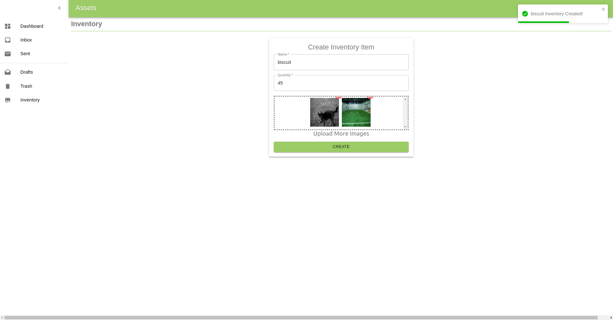

# Assets

An asset management app template.

## Build With

- React
- Material UI
- Laravel 10

## Build Log

```bash
npx create-react-app inventory
cd inventory
yarn add react-bootstrap
yarn add @material-ui/core
yarn add react-router-dom
yarn add react-icons
yarn add react-toastify
yarn add convert-form-data
yarn add keycloak-js
yarn add axios
yarn add react-router
yarn add file-saver

# Backend
composer create-project --prefer-dist laravel/laravel inventory-api
php artisan make:controller InventoryController --api
php artisan make:migration create_inventory_table --create=inventories
php artisan make:migration create_inventory_attachments_table --create=inventory_attachments
php artisan make:model Inventory
php artisan db:seed --class=InventorySeeder #error
php artisan make:resource InventoryResource
php artisan make:resource InventoryResourceCollection --collection
php artisan make:request InventoryValidation
php artisan make:model InventoryAttachment --migration
composer require phpoffice/phpspreadsheet
composer require barryvdh/laravel-dompdf

#after editing composer.json files for helpers class
php artisan clear-compiled 
composer dump-autoload
php artisan optimize

php artisan make:migration add_softdelete_into_inventory_attachments_table --table=inventory_attachments
php artisan make:migration add_batch_id_into_inventories_table --table=inventories
php artisan make:migration add_timestamp_update_into_inventory_attachments_table --table=inventory_attachments
```

## Run

yarn start

## Demo

### Dashboard


### Login


### Inventory


