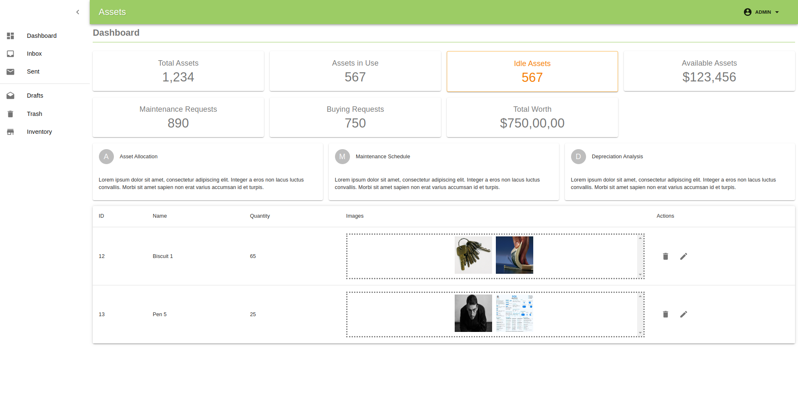

# Assets

An asset management app template.

## Build With
- React
- Material UI


## Build Log
```bash
npx create-react-app inventory
cd inventory
yarn add react-bootstrap
yarn add @material-ui/core
yarn add react-router-dom
```

## Run
yarn start

## Demo



